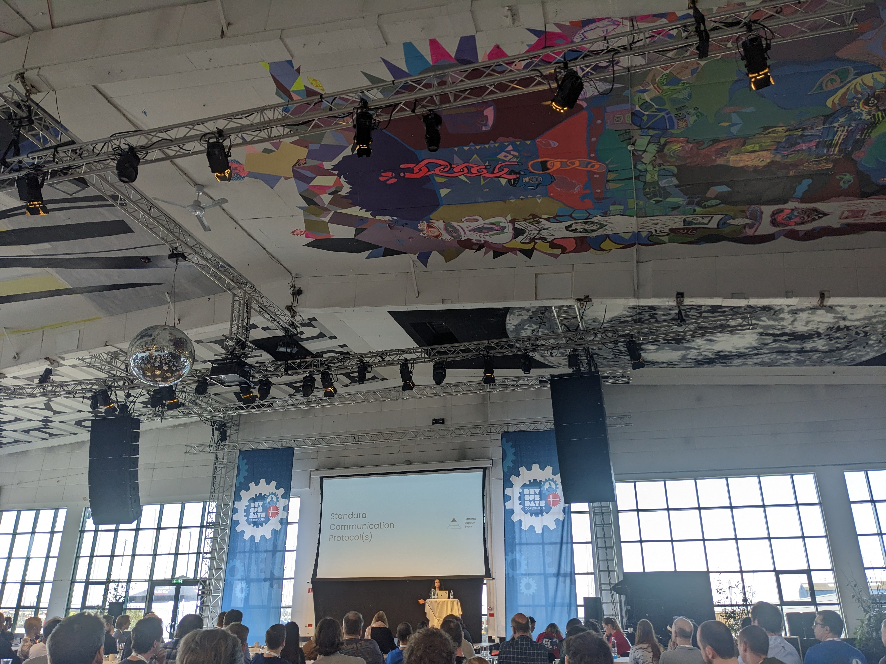
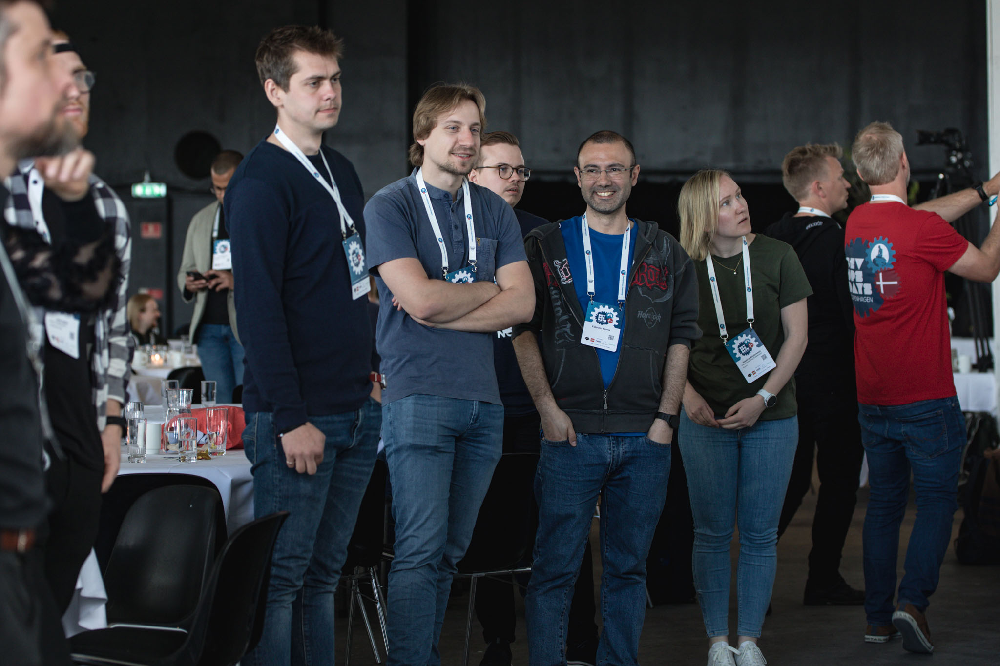
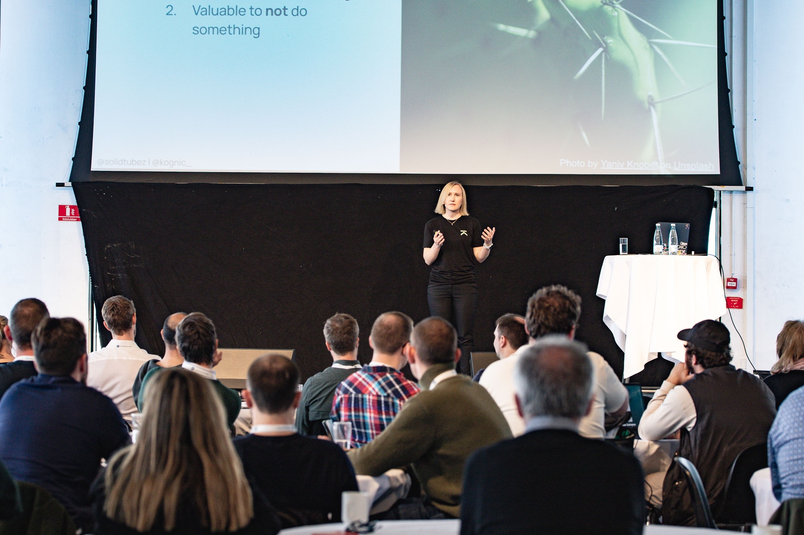

# DevOpsDays Copenhagen 2023

Last week I attended [DevOpsDays Copenhagen 2023](https://devopsdays.org/events/2023-copenhagen/program), held on 2-3 May at Docken Copenhagen. It's an event where the community comes together to share their experiences, learn from each other and connect with others in the industry. The conference had a diverse range of talks, open space discussions and networking opportunities that made it a great event for anyone interested in DevOps and its related practices.

The user stories shared by the speakers were inspiring, and the example given by [Braedon Gough](https://devopsdays.org/events/2023-copenhagen/program/braedon-gough) on how to implement on-call in their product teams was tangible and easy to learn from. [Waqas Ali and Jonas Rask](https://devopsdays.org/events/2023-copenhagen/program/waqas-ali) from Lego Group also gave a great talk, sharing how they built an internal developer portal on top of backstage. The talks were informative, insightful and a good foundation for open space discussions.

Which leads me to the next section! Open space sessions allowed attendees to connect with others who had similar interests and continue the discussions from the talks. People were free to move between the spaces, which allowed for a free flow of ideas and connections. I feel like this is probably the most appreciated aspect of the DevOpsDays conference! 

The hallway track is one of my personal favorites, both for the interesting conversations but also for the new friends I make. Shout out to everyone I talked to, I loved sharing experiences and comparing notes! 

Overall, DevOpsDays Copenhagen 2023 was a great event, and I'm grateful to have had the chance to participate and share our story. Thank you to the organizers for making this event possible, and I hope to see you again soon!

